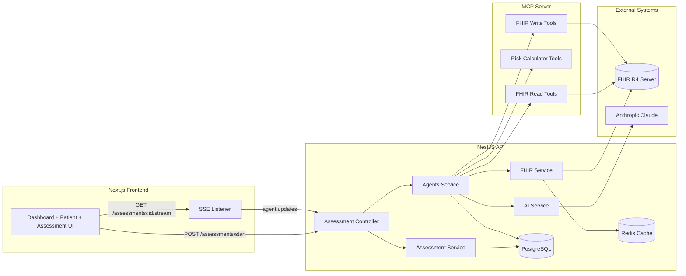

# PreOp Intel

PreOp Intel is a multi-agent perioperative risk intelligence system that reads FHIR data, computes validated risk scores, synthesizes recommendations with an orchestrator LLM, and writes actionable outputs back as FHIR resources.

## Architecture



## Why This Is Different

- Multi-agent workflow: cardiac, pulmonary, metabolic, then orchestrator synthesis.
- Standards-first interoperability: FHIR-native inputs and outputs.
- Last-mile utility: recommendations plus structured write-back (RiskAssessment, CarePlan, Flag, ServiceRequest).

## Quick Start

```bash
npm install
npm run build
npm run dev
```

## Demo And Submission Docs

- Playbook: [docs/HACKATHON_PLAYBOOK.md](docs/HACKATHON_PLAYBOOK.md)
