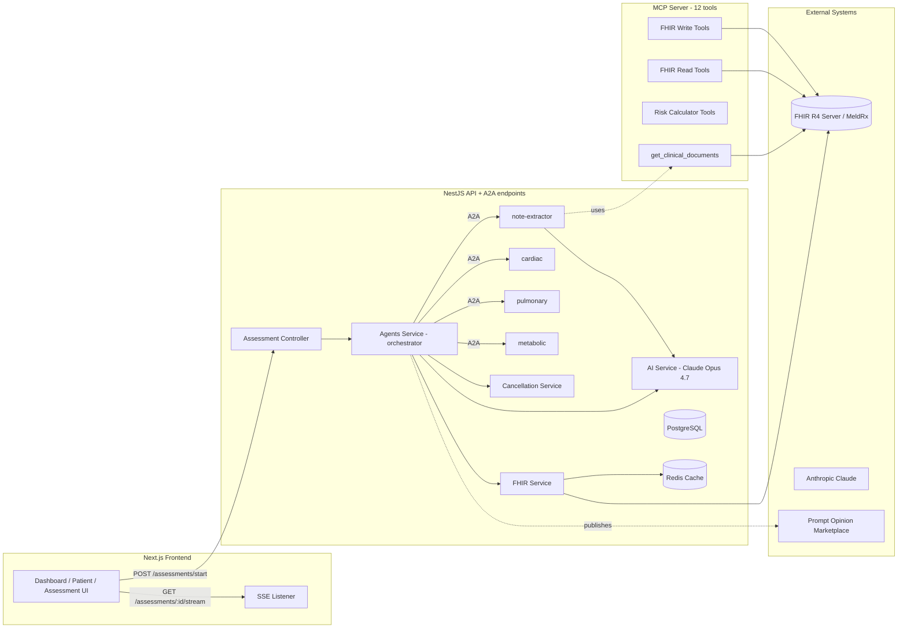

# PreOp Intel

> **PreOp Intel reads what doctors actually wrote.** Five A2A agents extract risk-relevant findings from H&P notes, consult letters, and outside-hospital discharge summaries — the things that cancel surgery the morning of — score them against validated guidelines, and write FHIR resources back to the chart with SHARP provenance extensions.

Built for the [Agents Assemble](https://agents-assemble.devpost.com/) hackathon.

## What's different

- **Reads unstructured notes, not just structured fields.** A recent NSTEMI documented only in an outside-hospital discharge summary, an apixaban discontinued two days ago in an H&P narrative, "ambulates with walker, dyspneic at one block" buried in a cardiology consult — all extracted, all clinically actionable, none findable by structured-only tools.
- **No-hallucination guarantee.** Every finding cites a verbatim source snippet. A deterministic verifier checks `documents[id].text.includes(snippet)` before display. Failed snippets are dropped, not surfaced.
- **Real A2A.** Five agents (note-extractor, cardiac, pulmonary, metabolic, orchestrator) registered with agent cards at `/.well-known/agent.json`, invokable via JSON-RPC-style task envelopes. `A2A_MODE=live` shows real HTTP traffic between agents.
- **SHARP provenance on every FHIR write-back.** `sharp-context-source`, `sharp-evidence-link`, `sharp-confidence` extensions on RiskAssessment, CarePlan, Flag, and ServiceRequest. Downstream systems can trace any recommendation back to the exact note text that justified it.
- **Auditable cancellation cost band.** $6,400–$10,800 (demo case) is a deterministic function of severity-weighted finding counts × surgery-specific OR-hour rate × urgency multiplier, citing Macario 2010 and Argo et al. 2009. The action plan is LLM-generated; the numbers are not.

## Architecture


```mermaid
flowchart LR
    subgraph Frontend[Next.js Frontend]
      UI[Dashboard / Patient / Assessment UI]
      SSE[SSE Listener]
    end

    subgraph Backend[NestJS API + A2A endpoints]
      AC[Assessment Controller]
      AG[Agents Service - orchestrator]
      NX[note-extractor]
      CD[cardiac]
      PL[pulmonary]
      MB[metabolic]
      AI[AI Service - Claude Opus 4.7]
      CN[Cancellation Service]
      FH[FHIR Service]
      DB[(PostgreSQL)]
      RD[(Redis Cache)]
    end

    subgraph MCP[MCP Server - 12 tools]
      DOC[get_clinical_documents]
      RT[FHIR Read Tools]
      CT[Risk Calculator Tools]
      WT[FHIR Write Tools]
    end

    subgraph External[External Systems]
      FS[(FHIR R4 Server / MeldRx)]
      AN[Anthropic Claude]
      MK[Prompt Opinion Marketplace]
    end

    UI -->|POST /assessments/start| AC
    UI -->|GET /assessments/:id/stream| SSE
    AC --> AG
    AG -- A2A --> NX & CD & PL & MB
    AG --> AI
    AG --> CN
    NX --> AI
    AG --> FH
    FH --> RD
    FH --> FS
    DOC --> FS
    RT --> FS
    WT --> FS
    NX -. uses .-> DOC
    AG -.publishes.-> MK
```

## Quick start

```bash
docker-compose up -d            # Postgres + Redis
npm install
npm run build
npm run dev                     # Starts backend, frontend, MCP server
```

Open http://localhost:3000, click into Robert Chen, click **Start Assessment**.

## Test

```bash
cd apps/backend
node --test test/*.test.mjs     # 33 tests, deterministic, no API key needed

# Live LLM extraction smoke test (~$0.01):
ANTHROPIC_API_KEY=sk-... node test/note-extractor.live.mjs
```

## Documentation

- [Architecture](docs/ARCHITECTURE.md) — runtime topology, agent design, conflict resolution, SHARP / MCP / A2A / FHIR standards
- [Setup](docs/SETUP.md) — local development, environment variables, demo + live FHIR modes
- [Testing](docs/TESTING.md) — 33 unit tests, live LLM smoke test, what's covered and why
- [Deploy](docs/DEPLOY.md) — AWS Lambda + Vercel deployment, SSM secrets, rollback
- [MeldRx note-seeding script](scripts/seed-meldrx-notes.mjs) — populate a live FHIR sandbox with `DocumentReference` + `Binary` resources for the demo patient
