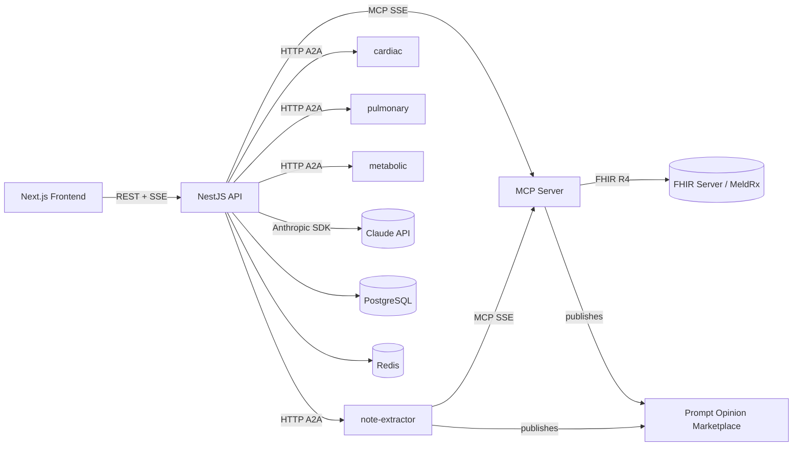
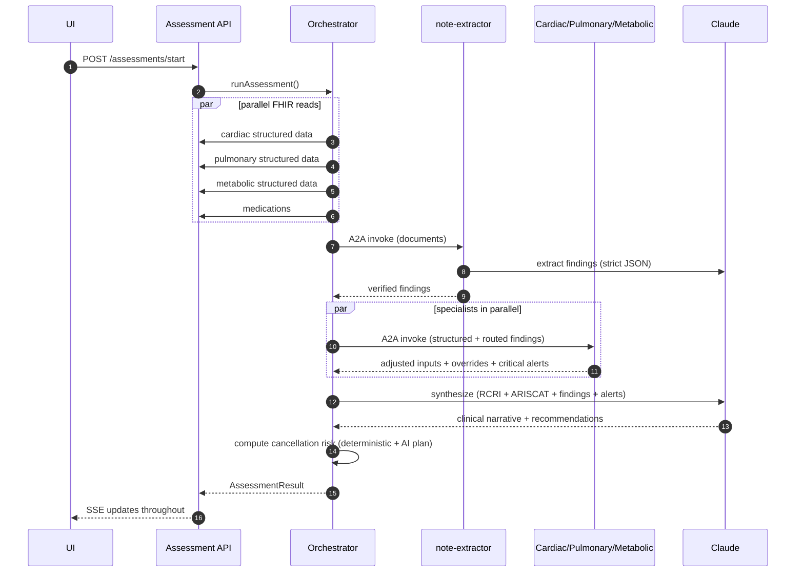

# Architecture

PreOp Intel is a multi-agent perioperative risk system structured as a Turborepo monorepo with three deployable apps and a shared types/constants package. This document covers the runtime architecture, agent design, conflict-resolution rules, persistence model, and the standards (FHIR / MCP / A2A / SHARP) the system implements.

## Top-level layout

```
preop-intel/
├── apps/
│   ├── frontend/        # Next.js 14 (App Router), Tailwind, shadcn/ui, Zustand
│   ├── backend/         # NestJS 10 + Lambda adapter
│   └── mcp-server/      # Standalone MCP server (Express + @modelcontextprotocol/sdk)
├── packages/
│   └── shared/          # TypeScript types + constants used by all apps
├── scripts/
│   ├── deploy.sh        # AWS Lambda + Vercel deploy orchestrator
│   ├── setup-ssm.sh     # Provision SSM parameters for secrets
│   └── seed-meldrx-notes.mjs  # Seed clinical notes to a live FHIR sandbox
└── docker-compose.yml   # Postgres + Redis for local development
```

## Runtime topology



## Components

### Frontend (`apps/frontend`)

Next.js 14 App Router. Three primary routes:

- `/dashboard` — patient list (demo: Robert Chen)
- `/patient/[patientId]` — clinical summary
- `/patient/[patientId]/assessment` — main demo screen with agent pipeline, risk gauges, findings panel, cancellation panel, FHIR JSON viewer

Subscribes to backend SSE at `/api/assessments/{id}/stream` for agent status updates. Uses Zustand for client-side store and TanStack Query for data fetching.

### Backend (`apps/backend`)

NestJS app, deployed to AWS Lambda via the `serverless-express` adapter. Modules:

- `assessment` — controller + service for `POST /api/assessments/start`, `GET /api/assessments/:id`, `GET /api/assessments/:id/stream` (SSE)
- `agents` — orchestrator service, note-extractor service, findings routing/application helpers, A2A client
- `risk` — RCRI + ARISCAT calculators, cancellation risk service
- `ai` — Anthropic SDK wrapper, orchestrator prompt builder
- `fhir` — `fhir-kit-client` wrapper with Redis caching (300s TTL)
- `auth` — SMART on FHIR OAuth flow
- `database` — TypeORM, single `AssessmentSession` entity (metadata only, no PHI)
- `a2a` — agent cards, JSON-RPC-style task envelopes, per-agent HTTP endpoints

### MCP server (`apps/mcp-server`)

Standalone Express server using `@modelcontextprotocol/sdk` over SSE transport. Exposes 12 tools:

| # | Tool | Purpose |
|---|---|---|
| 1 | `get_patient_surgical_data` | Patient demographics + procedure history |
| 2 | `get_cardiac_risk_data` | RCRI inputs from Condition + Observation |
| 3 | `get_pulmonary_risk_data` | ARISCAT inputs from Observation + Patient |
| 4 | `get_metabolic_risk_data` | HbA1c, eGFR, BMI, creatinine |
| 5 | `get_medication_risk_data` | MedicationRequest + AllergyIntolerance |
| 6 | `get_clinical_documents` | DocumentReference + Binary content |
| 7 | `calculate_rcri_score` | Lee 1999 RCRI calculator |
| 8 | `calculate_ariscat_score` | Canet 2010 ARISCAT calculator |
| 9 | `create_risk_assessment` | FHIR write-back with SHARP extensions |
| 10 | `create_care_plan` | CarePlan + Goals with SHARP extensions |
| 11 | `create_flag` | Safety Flag with SHARP extensions |
| 12 | `create_service_request` | Specialty referral with SHARP extensions |

### Shared package (`packages/shared`)

TypeScript-only. Three categories:

- `types/` — FHIR resource subset, RCRI/ARISCAT, agent types, note types (`ClinicalDocument`, `ClinicalFinding`), cancellation types, SHARP extension types
- `constants/` — LOINC codes, ICD-10 prefix maps, risk thresholds, SNOMED specialty codes
- `mock/` — demo patient, demo notes, pre-built FHIR resources

## Agent design

Five A2A agents. Each is registered with an agent card at `/a2a/agents/{name}/.well-known/agent.json` and accepts tasks at `/a2a/agents/{name}/tasks`.



### Note extractor

Pipeline: LLM extraction → deterministic verifier → confidence gating → category-tagged output.

**Hallucination prevention:**
1. JSON schema requires `sourceSnippet` and `sourceDocumentId` per finding.
2. Verifier runs `documents[id].text.includes(snippet)` for every finding. Failures are dropped.
3. Confidence gating:
   - `< 0.6` — log only, never displayed
   - `0.6 ≤ x < 0.85` — `displayState='possible'`, surface as "Possible — Review"
   - `≥ 0.85` — `displayState='detected'`

Implementation: `apps/backend/src/modules/agents/note-extractor.service.ts`. The pure `verifyAndGateFindings()` export is testable without the LLM.

### Findings routing

Findings are categorized (`medication` / `cardiac-event` / `functional` / `respiratory` / `metabolic` / `other`) and routed to specialists by domain:

| Specialist | Categories consumed |
|---|---|
| cardiac | cardiac-event · medication · functional |
| pulmonary | respiratory · functional |
| metabolic | metabolic · medication |

Implementation: `apps/backend/src/modules/agents/findings-routing.ts`.

### Conflict resolution

When a finding conflicts with structured FHIR data, resolution depends on the conflict type and confidence:

- **Universal rule** — confidence `≥ 0.85` and the note post-dates the structured record → finding overrides the structured value. The override is recorded in a `FieldOverride` entry that flows into the `sharp-evidence-link` extension on the FHIR write-back.
- **Medication-status exception** — conflicts that change a medication's `active ↔ discontinued` status *always* require explicit clinician confirmation. The finding is surfaced with `displayState='pending-confirmation'` and does not auto-flow into RCRI/ARISCAT inputs.

Implementation: `apps/backend/src/modules/agents/findings-application.ts`.

### Cancellation risk model

Three components:

- **Score** (0–100, deterministic). Function of severity-weighted finding counts and an urgency multiplier (days-to-surgery). Capped at 100.
- **Cost band** (low/high USD). Surgery-type-specific OR-hour rate × estimated hours × urgency multiplier, plus per-finding severity contribution. Numbers cite Macario 2010 (Anesthesiol Clin) and Argo et al. 2009 (Am J Surg).
- **Action plan** (LLM-generated, owner-tagged markdown). Coordinated narrative grouping issues by `anesthesia` / `surgery` / `cardiology` / `endocrinology` / `primary-care` / `patient`.

Implementation: `apps/backend/src/modules/risk/cancellation.service.ts`. Pure functions for score and cost are exported for unit testing.

## Standards implemented

### FHIR R4

Read: `Patient`, `Condition`, `Observation`, `Procedure`, `MedicationRequest`, `AllergyIntolerance`, `DocumentReference`, `Binary`.

Write: `RiskAssessment`, `CarePlan`, `Goal`, `Flag`, `ServiceRequest`. All write resources accept SHARP context and emit the corresponding extensions.

### MCP (Model Context Protocol)

Standalone server using `@modelcontextprotocol/sdk` over SSE transport. Publishable to Prompt Opinion's marketplace.

### A2A (Agent-to-Agent)

Minimal sync surface: agent cards at `/.well-known/agent.json`, JSON-RPC-style task envelopes at `/{name}/tasks`. The `A2AClient` makes real HTTP calls between agents when `A2A_MODE=live` (default `local` for deterministic demo recording). All five agents are individually publishable to Prompt Opinion.

### SHARP Extension Specs

Three extensions emitted on every FHIR write-back resource:

- `http://sharp-spec.org/StructureDefinition/sharp-context-source` — agent name (`note-extractor`, `orchestrator`, etc.)
- `http://sharp-spec.org/StructureDefinition/sharp-evidence-link` — sub-extensions: `documentReference` (FHIR Reference), `snippet` (verbatim text, ≤300 chars), optional `findingId`/`category`/`severity`
- `http://sharp-spec.org/StructureDefinition/sharp-confidence` — decimal 0..1

Implementation: `packages/shared/src/types/sharp.types.ts` (URL constants and `buildSharpExtensions()` builder).

## Persistence

- **PostgreSQL** — `AssessmentSession` table (metadata only: id, patientId, status, scores, timestamps). No PHI persisted; raw FHIR data stays in the FHIR server.
- **Redis** — short-lived FHIR response cache (300s TTL). Patient data doesn't change during a 60-second assessment.

This satisfies HIPAA Safe Harbor: source-of-truth PHI never leaves the FHIR server.

## Authentication

SMART on FHIR OAuth 2.0. Required for EHR-embedded apps (Epic App Orchard, Cerner). The frontend redirects to the FHIR server's authorize endpoint, exchanges the code for a token via the backend's `/auth/callback`, and stores the bearer token in `sessionStorage` for the assessment lifetime.

## Configuration boundaries

| Variable | Where | Purpose |
|---|---|---|
| `A2A_MODE` | backend env | `local` (default) → in-process; `live` → HTTP between agents |
| `A2A_BASE_URL` | backend env | Base URL the A2A client uses; defaults to `http://localhost:${PORT}` |
| `ORCHESTRATOR_MODEL` | backend env | Override orchestrator model (default `claude-opus-4-7`) |
| `NOTE_EXTRACTOR_MODEL` | backend env | Override extractor model (default `claude-sonnet-4-6`) |
| `ACTION_PLAN_MODEL` | backend env | Override cancellation-action-plan model (default `claude-sonnet-4-6`) |

See [SETUP.md](SETUP.md) for the full env var inventory.

## Testing

33 unit tests under `apps/backend/test/`:

- `note-extractor.verify.test.mjs` (8) — verifier behavior, confidence gating, medication-status exception, category filter
- `cancellation-and-findings.test.mjs` (17) — score, cost band, preventable issues, cardiac/pulmonary/metabolic findings application, routing
- `sharp-and-a2a.test.mjs` (8) — SHARP extension structure, agent cards, A2A equivalence

Plus a runnable LLM smoke test (`note-extractor.live.mjs`) for end-to-end extractor validation against `DEMO_NOTES`.

See [TESTING.md](TESTING.md) for how to run.
