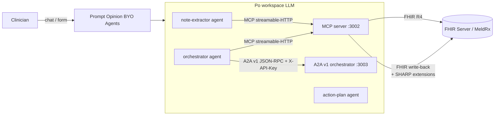
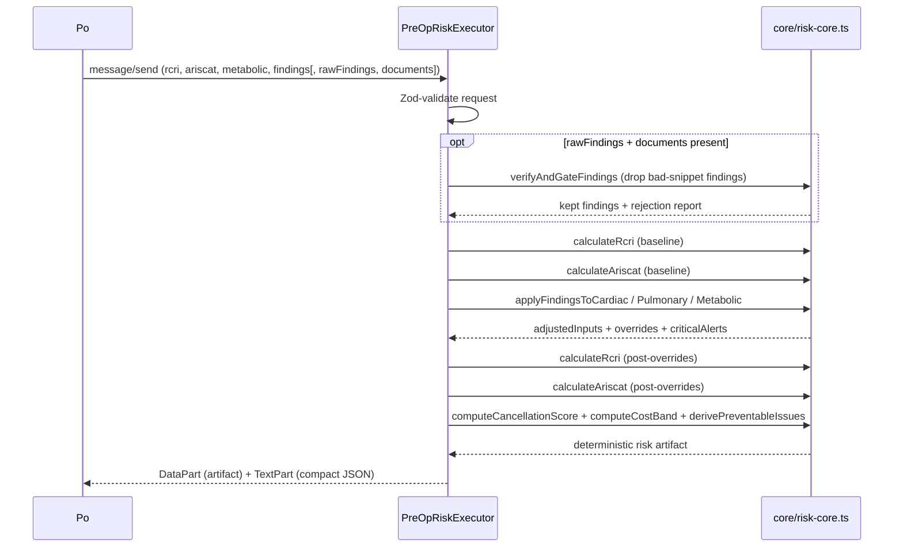

# Architecture

PreOp Intel is the Po-native deterministic backend behind a perioperative-risk hackathon submission. Two services run on Node + Express: an MCP tool server and an A2A v1 orchestrator. A Next.js frontend ships in this repo as a visual demo of the patient banner / FHIR resource viewer / journey UI but does not drive any live workflow — Po does.

## Top-level layout

```
preop-intel/
├── apps/
│   ├── frontend/              # Next.js 14 — visual artifact only
│   ├── backend/
│   │   └── src/a2a-v1/        # Po-compatible A2A v1 orchestrator (Express)
│   │       └── core/risk-core.ts  # Pure deterministic core (RCRI, ARISCAT, findings, cancellation, verifier)
│   └── mcp-server/            # Po-compatible MCP server (streamable-HTTP)
├── packages/
│   └── shared/                # TypeScript types + constants used by both services
├── docs/
│   └── po-agents/             # Pasteable Po BYO agent system prompts
└── scripts/
    └── seed-meldrx-notes.mjs  # Seed clinical notes to a live FHIR sandbox
```

## Runtime topology



Po fans out three BYO agents inside its workspace. They share state through Po. We expose two HTTPS endpoints they call:

- **MCP** at `/mcp` — 12 tools (FHIR read, RCRI/ARISCAT calculators, FHIR write-back, document fetcher).
- **A2A v1** at `/.well-known/agent-card.json` + `POST /` — single skill, returns a deterministic risk artifact.

## Components

### A2A v1 server (`apps/backend/src/a2a-v1`)

| File | Role |
|---|---|
| `server.ts` | Process entry. Reads `A2A_PORT` / `A2A_PUBLIC_URL` / `FHIR_EXTENSION_URI` / `PO_AGENT_REQUIRE_API_KEY`. |
| `app-factory.ts` | Wires `express` + `DefaultRequestHandler` + `InMemoryTaskStore` + `PreOpRiskExecutor`. Order: log → agent card (public) → rate limit → API key → JSON-RPC. |
| `agent-card.ts` | Builds the `AgentCard`: `protocolVersion: '0.3.0'`, `preferredTransport: 'JSONRPC'`, `capabilities.extensions[fhirExtensionUri]`, `securitySchemes.apiKey`, single skill `assess-preoperative-risk`. |
| `middleware.ts` | `apiKeyMiddleware` validates `X-API-Key` against `PO_AGENT_API_KEY_PRIMARY` / `SECONDARY`. `/.well-known/agent-card.json` and `/health` bypass. |
| `observability.ts` | Per-key + per-IP token bucket rate limit (default 60/min, configurable via `A2A_RATE_LIMIT_PER_MIN`). Single-line JSON request log written to stdout. |
| `fhir-context.ts` | `extractFhirContext(message)` reads `message.metadata` for any key matching the FHIR-context extension URI Po declared, parses `{fhirUrl, fhirToken, patientId}`. |
| `executor.ts` | `PreOpRiskExecutor implements AgentExecutor`. Pure deterministic: no LLM calls. Validates input with Zod, runs `calculateRcri` + `calculateAriscat` + `applyFindingsTo*` + `computeCancellationScore` + `computeCostBand` + `derivePreventableIssues`, optionally re-verifies snippets via `verifyAndGateFindings` when caller passes raw findings + documents. Publishes a `DataPart` artifact + `TextPart` summary back through `ExecutionEventBus`. |
| `core/risk-core.ts` | All pure functions in one file: RCRI / ARISCAT calculators, findings router + applier, cancellation score / cost / preventable issues, snippet verifier. |

#### Wire contract

`POST /` body (per A2A v1 `message/send`):

```json
{
  "jsonrpc": "2.0",
  "id": 1,
  "method": "message/send",
  "params": {
    "message": {
      "messageId": "<uuid>",
      "role": "user",
      "kind": "message",
      "metadata": {
        "https://app.promptopinion.ai/schemas/a2a/v1/fhir-context": {
          "fhirUrl": "...",
          "fhirToken": "...",
          "patientId": "..."
        }
      },
      "parts": [{
        "kind": "data",
        "data": {
          "plannedProcedure": "Total knee",
          "daysToSurgery": 14,
          "surgeryType": "orthopedic",
          "rcri":     { /* RcriInput */ },
          "ariscat":  { /* AriscatInput */ },
          "metabolic":{ /* MetabolicRiskData */ },
          "findings": [ /* ClinicalFinding[] (already verified upstream) */ ],
          "rawFindings": [ /* optional — RawFinding[] for defensive re-verification */ ],
          "documents":   [ /* optional — ClinicalDocument[] for verifier */ ]
        }
      }]
    }
  }
}
```

Response is a single message containing a `DataPart` (the deterministic artifact) and a `TextPart` (compact JSON repr of the same).

### MCP server (`apps/mcp-server`)

`@modelcontextprotocol/sdk` v1.29 over **streamable-HTTP** (Po's required MCP transport). Stateless mode (`sessionIdGenerator: undefined`) — each `POST /mcp` builds a fresh `McpServer` + transport. Per-request FHIR context is propagated through Node's `AsyncLocalStorage`:

- The HTTP layer reads `x-fhir-server-url`, `x-fhir-access-token`, `x-patient-id` from the request headers.
- Each tool calls `resolveFhirContext(args)` — explicit args win, header-derived context fills gaps, missing values throw a clear error.
- `GET /mcp` and `DELETE /mcp` return 405 (stateless server has no resumable session).

Exposes 12 tools:

| # | Tool | Purpose |
|---|---|---|
| 1 | `get_patient_surgical_data` | Patient demographics + procedure history |
| 2 | `get_cardiac_risk_data` | RCRI inputs from Condition + Observation |
| 3 | `get_pulmonary_risk_data` | ARISCAT inputs from Observation + Patient |
| 4 | `get_metabolic_risk_data` | HbA1c, eGFR, BMI, creatinine |
| 5 | `get_medication_risk_data` | MedicationRequest + AllergyIntolerance |
| 6 | `get_clinical_documents` | DocumentReference + Binary content. Caps text at `MCP_MAX_DOCUMENT_BYTES` (default 5MB); oversized docs return metadata-only with `skipped: 'oversize'` |
| 7 | `calculate_rcri_score` | Lee 1999 RCRI calculator |
| 8 | `calculate_ariscat_score` | Canet 2010 ARISCAT calculator |
| 9 | `create_risk_assessment` | FHIR write-back with SHARP extensions |
| 10 | `create_care_plan` | CarePlan + Goals with SHARP extensions |
| 11 | `create_flag` | Safety Flag with SHARP extensions |
| 12 | `create_service_request` | Specialty referral with SHARP extensions |

### Shared package (`packages/shared`)

TypeScript-only:

- `types/` — FHIR resource subset, RCRI/ARISCAT, finding types, cancellation types, SHARP extension types
- `constants/` — LOINC codes, ICD-10 prefix maps, risk thresholds, SNOMED specialty codes
- `mock/` — demo patient, demo notes, pre-built FHIR resources (used by the visual frontend)

### Frontend (`apps/frontend`)

Next.js 14 App Router. **Visual artifact only.** The dashboard, patient banner, journey stepper, FHIR JSON viewer, findings panel, and risk gauge are real. The "Start Assessment" button on `/patient/[id]/assessment` calls `/api/assessments/start` which no longer exists in this repo — that path was the standalone-LLM backend before the Po pivot. Useful for screenshots; not the live demo.

## Risk pipeline (inside the executor)

When Po calls `message/send`, the executor runs:



### Findings routing & application

Findings are categorized (`medication` / `cardiac-event` / `functional` / `respiratory` / `metabolic` / `other`) and routed to specialists by domain:

| Specialist | Categories consumed |
|---|---|
| cardiac | cardiac-event · medication · functional |
| pulmonary | respiratory · functional |
| metabolic | metabolic · medication |

Source: `core/risk-core.ts → routeFindingsToSpecialist`.

### Conflict resolution

When a finding conflicts with structured FHIR data, resolution depends on the conflict type and confidence:

- **Universal rule** — confidence ≥ 0.85 and the note post-dates the structured record → finding overrides the structured value. The override is recorded in a `FieldOverride` entry that flows into the `sharp-evidence-link` extension on the FHIR write-back.
- **Medication-status exception** — conflicts that change a medication's `active ↔ discontinued` status *always* require explicit clinician confirmation. The finding is surfaced with `displayState='pending-confirmation'` and does not auto-flow into RCRI/ARISCAT inputs.

### Cancellation risk model

Three components:

- **Score** (0–100, deterministic). Function of severity-weighted finding counts and an urgency multiplier (days-to-surgery). Capped at 100.
- **Cost band** (low/high USD). Surgery-type-specific OR-hour rate × estimated hours × urgency multiplier, plus per-finding severity contribution. Numbers cite Macario 2010 (Anesthesiol Clin) and Argo et al. 2009 (Am J Surg).
- **Preventable issues** — owner-tagged list (anesthesia / surgery / cardiology / endocrinology / primary-care / patient). The Po `action-plan` BYO agent (prompt: `docs/po-agents/action-plan.system.md`) reads these and emits the markdown coordinated plan.

## Standards implementation

### FHIR R4

Read: `Patient`, `Condition`, `Observation`, `Procedure`, `MedicationRequest`, `AllergyIntolerance`, `DocumentReference`, `Binary`.

Write: `RiskAssessment`, `CarePlan`, `Goal`, `Flag`, `ServiceRequest`. All write resources accept SHARP context and emit the corresponding extensions.

### MCP

`@modelcontextprotocol/sdk` v1.29 streamable-HTTP. FHIR context propagates per-request via `AsyncLocalStorage` from `x-fhir-server-url` / `x-fhir-access-token` / `x-patient-id` headers, so the same MCP server handles many tenants concurrently.

### A2A v1 (spec 0.3.0)

Single agent `preop_intel_orchestrator` exposing one skill `assess-preoperative-risk`. Authenticates with `X-API-Key`. FHIR context flows in `message.metadata` under the URI declared in `capabilities.extensions`. Returns a deterministic `DataPart` artifact.

### SHARP Extension Specs

Three extensions emitted on every FHIR write-back resource:

- `http://sharp-spec.org/StructureDefinition/sharp-context-source` — agent name (`note-extractor`, `orchestrator`, etc.)
- `http://sharp-spec.org/StructureDefinition/sharp-evidence-link` — sub-extensions: `documentReference` (FHIR Reference), `snippet` (verbatim text, ≤300 chars), optional `findingId`/`category`/`severity`
- `http://sharp-spec.org/StructureDefinition/sharp-confidence` — decimal 0..1

Implementation: `packages/shared/src/types/sharp.types.ts` (URL constants and `buildSharpExtensions()` builder).

## Configuration boundaries

| Variable | Where | Purpose |
|---|---|---|
| `A2A_PORT` | A2A server | Port to bind (default 3003) |
| `A2A_PUBLIC_URL` | A2A server | Public URL advertised in the AgentCard |
| `PO_AGENT_API_KEY_PRIMARY` / `_SECONDARY` | A2A server | Valid `X-API-Key` values |
| `PO_AGENT_REQUIRE_API_KEY` | A2A server | Set `false` only for local dev curl |
| `FHIR_EXTENSION_URI` | A2A server | Po's FHIR-context extension URI in message metadata |
| `A2A_RATE_LIMIT_PER_MIN` | A2A server | Override default 60 |
| `MCP_PORT` | MCP server | Port to bind (default 3002) |
| `MCP_MAX_DOCUMENT_BYTES` | MCP server | Cap on returned document text (default 5MB) |

See [SETUP.md](SETUP.md) for the full env var inventory + Po registration steps.

## Testing

34 unit tests under `apps/backend/test/`:

- `note-extractor.verify.test.mjs` (8) — verifier behavior, confidence gating, medication-status exception, category filter
- `cancellation-and-findings.test.mjs` (17) — score, cost band, preventable issues, cardiac/pulmonary/metabolic findings application, routing
- `sharp-and-a2a.test.mjs` (9) — SHARP extension structure, A2A v1 agent card (protocolVersion 0.3.0, FHIR extension URI, security scheme, skill id), findings application smoke

See [TESTING.md](TESTING.md) for how to run.
